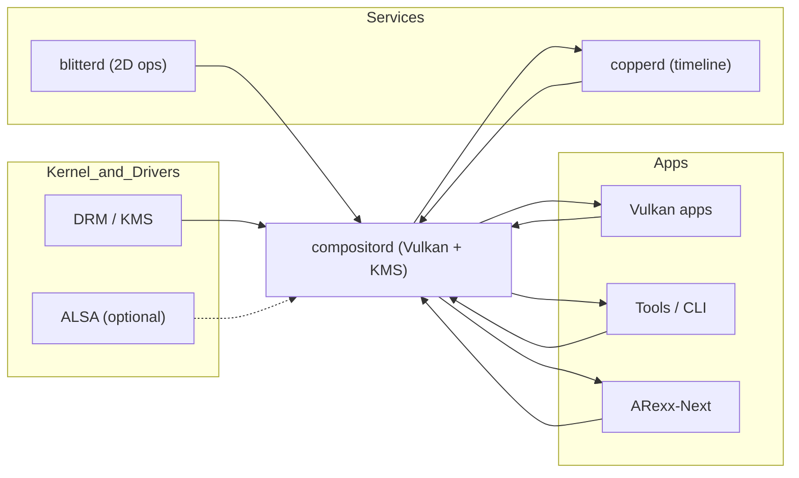

# compositord

**CopperlineOS Vulkan/KMS compositor.**  
`compositord` owns the display pipeline. It imports client buffers (DMABUFs), manages on-screen **layers**, and composites them on a **vsync-paced timeline**. It exposes a small **register model** (`layer[n].x/y/alpha/z/visible`, etc.) so timed programs (from `copperd`) and apps can move and blend things with rock‑solid latency.

> TL;DR: a lean compositor that feels like hardware. Layers and registers you can poke at frame time—no bloated stack in the way.

---

## Why it exists

Typical desktops put many layers between apps and pixels, which is great for features but not for **determinism**. CopperlineOS splits responsibilities: `compositord` makes pixels **fast and predictable**, `copperd` tells *when* to change them. Together they deliver Amiga‑style immediacy on modern GPUs.

- **Deterministic frame loop**: runs at the display’s vsync cadence.  
- **Tiny, explicit API**: layers with numeric registers you can set.  
- **Zero‑copy**: DMABUF import from apps; blits via Vulkan transfer/compute.  
- **Scriptable**: controlled via a message port (JSON in Phase‑0).

---

## Status

- Phase‑0 JSON protocol: **stable‑ish (v0)**  
- Backends: **DRM/KMS** (preferred), experimental **Wayland/X11** host mode  
- Language: Rust  
- License: MIT OR Apache‑2.0

---

## Architecture (Phase‑0)



<details>
<summary>Text-only fallback (if Mermaid fails)</summary>

```
Apps (Vulkan, Tools, ARexx) -> compositord
Services (copperd, blitterd) -> compositord
Kernel/Drivers (DRM/KMS, ALSA optional) -> compositord
compositord -> copperd (vsync ticks)
compositord -> Apps (events)
```
</details>

<details>
<summary>Text-only fallback (if Mermaid fails)</summary>

```
Apps (Vulkan, Tools, ARexx) -> compositord
Services (copperd, blitterd) -> compositord
Kernel/Drivers (DRM/KMS, ALSA optional) -> compositord
compositord -> copperd (vsync ticks)
compositord -> Apps (events)
```
</details>

- **DMABUF import** for client buffers (apps, blitterd).  
- **Layer register model** the rest of the system writes to.  
- **Vsync feed** published to `copperd` and subscribers.

---

## Concepts

- **Layer**: a composited surface with registers: `x`, `y`, `alpha`, `z`, `visible`, `scale_x`, `scale_y`, `rotation` (deg), `blend` (`normal`, `add`, `mul`, `screen`).  
- **Register writes**: atomic per-frame; late writes apply to the next frame.  
- **Outputs**: connectors / CRTCs / modes from DRM (hotplug aware).  
- **Clock**: vsync‑driven; falls back to high‑res timer if needed.

---

## Registers (Phase‑0)

Backed by double‑buffered state; updates are latched on vsync.

| Register | Type | Range | Notes |
|---|---|---|---|
| `layer[n].x` | int | pixels | Left position |
| `layer[n].y` | int | pixels | Top position |
| `layer[n].alpha` | float | 0.0–1.0 | Per‑layer opacity |
| `layer[n].z` | int | any | Draw order (higher = in front) |
| `layer[n].visible` | bool | true/false | Visibility toggle |
| `layer[n].scale_x` | float | >0 | Default 1.0 |
| `layer[n].scale_y` | float | >0 | Default 1.0 |
| `layer[n].rotation` | float | degrees | Pivot is layer center |
| `layer[n].blend` | enum | normal/add/mul/screen | Compositing mode |

---

## Protocol (Phase‑0 JSON, v0)

**Socket (default):** `/run/copperline/compositord.sock`  
Configurable via `COMPOSITORD_SOCKET`.

### Client → `compositord`

- `{"cmd":"ping"}` → `{"ok":true,"name":"compositord","version":"0.1.0"}`
- `{"cmd":"output_list"}` → `{"ok":true,"outputs":[{"id":0,"name":"HDMI-A-1","modes":[...],"current_mode":{...}}]}`
- `{"cmd":"output_set_mode","id":0,"mode":{"w":1920,"h":1080,"hz":60}}`
- `{"cmd":"create_layer"}` → `{"ok":true,"id":1}` *(IDs are auto-assigned)*
- `{"cmd":"destroy_layer","id":1}`
- `{"cmd":"bind_dmabuf","id":1,"fd":<int>,"w":128,"h":128,"format":"RGBA8","stride":512,"modifier":"LINEAR"}`
- `{"cmd":"bind_image","id":1,"path":"/tmp/sprite.rgba","w":128,"h":128,"format":"RGBA8"}` *(debug/testing)*
- `{"cmd":"unbind","id":1}`
- `{"cmd":"set","id":1,"x":100,"y":360,"alpha":1.0,"z":10,"visible":true}`
- `{"cmd":"set_regs","regs":{"layer[1].x":100,"layer[1].y":360}}` *(batch)*
- `{"cmd":"commit"}` *(optional barrier; otherwise commits at vsync)*
- `{"cmd":"subscribe","events":["vsync","pageflip","hotplug","error"]}`

### Events (server → client)

- `{"event":"vsync","usec":12345678,"frame":424242}`  
- `{"event":"pageflip","frame":424242}`  
- `{"event":"hotplug","outputs":[ ... ]}`  
- `{"event":"error","message":"..."}"`

---

## Quick start

### 1) Run compositord

```bash
# Prereqs: Vulkan loader/driver, DRM/KMS access (seatd/logind recommended)
git clone https://github.com/CopperlineOS/compositord
cd compositord
cargo build --release
RUST_LOG=info ./target/release/compositord
```

Environment variables:

- `COMPOSITORD_SOCKET=/run/copperline/compositord.sock`  
- `COMPOSITORD_BACKEND=kms|wayland|x11` (default: `kms`)  
- `COMPOSITORD_OUTPUT=auto|HDMI-A-1` (choose connector)  
- `COMPOSITORD_MODE=1920x1080@60` (preferred mode override)

### 2) Create a layer and bind an image

Using `portctl` (from `CopperlineOS/tools`):

```bash
# Create layer id 1
portctl /run/copperline/compositord.sock '{"cmd":"create_layer"}'

# Bind a test RGBA image (raw 128x128)
portctl /run/copperline/compositord.sock   '{"cmd":"bind_image","id":1,"path":"/tmp/sprite.rgba","w":128,"h":128,"format":"RGBA8"}'

# Place it at (100,360) on top
portctl /run/copperline/compositord.sock   '{"cmd":"set","id":1,"x":100,"y":360,"alpha":1.0,"z":10,"visible":true}'
```

Now run the **Copper** demo to animate it:

```bash
# load & start the infinite rightward move (see copperd README for /tmp/demo.json)
portctl /run/copperline/copperd.sock "$(jq -c '{cmd:"load",program:.}' /tmp/demo.json)"
portctl /run/copperline/copperd.sock '{"cmd":"start","id":1}'
```

---

## Building from source

```bash
# Toolchain
rustup default stable
rustup component add rustfmt clippy

# Optional system libraries (names vary by distro):
# - Vulkan loader/headers, libdrm, wayland-client (if using host mode)

# Build & test
cargo fmt --all
cargo clippy --all-targets -- -D warnings
cargo test
```

Minimum Rust: **1.78+**.

---

## Development guide

- **Crates**: `compositord-core` (graph/layers), `compositord-backend` (KMS/host), `compositord-ipc` (protocol), `compositord-bin` (daemon).  
- **Frame loop**: gather register writes → latch → composite → pageflip, once per vsync.  
- **DMABUF**: imported via `DMA_HEAP`/`prime` FDs; validated size/format/modifier; lifetime tracked.  
- **Shaders**: minimal set for blend modes; sRGB‑aware sampling.  
- **Planes**: Phase‑0 composites in GPU; Phase‑1 maps simple cases to HW planes.  
- **Timing**: publishes `vsync` events and frame counters to copperd (and subscribers).  
- **Safety**: checks for invalid IDs, stale FDs, size/format mismatches; clamps out‑of‑range registers.

---

## Roadmap

- **v0.1**: KMS backend, DMABUF import, layers/regs, basic blend, vsync events.  
- **v0.2**: Hardware plane mapping, partial damage, fences (Vulkan timeline) to/from `copperd`.  
- **v0.3**: Color management (HDR metadata, ICC), screenshots/recording via zero‑copy taps.  
- **v0.4**: Multi‑output spanning, hotplug robustness, low‑latency capture for streaming.  
- **v0.5**: Security caps per client (layer quotas, z‑range, rate limits).

RFCs will live in [`CopperlineOS/rfcs`](https://github.com/CopperlineOS/rfcs).

---

## Contributing

We welcome issues and PRs!

1. Read `CONTRIBUTING.md`.  
2. Check **good first issue** / **help wanted** labels.  
3. Protocol or register changes → open an RFC and link it in your PR.

Code of Conduct: `CODE_OF_CONDUCT.md`.

---

## Security

`compositord` may require DRM/KMS privileges. Prefer running under **seatd/logind** rather than root.  
Report vulnerabilities privately to **security@copperline.os** (placeholder) or via GitHub advisories. See `SECURITY.md`.

---

## License

Dual-licensed under **Apache‑2.0 OR MIT**.

---

## See also

- [`copperd`](https://github.com/CopperlineOS/copperd): timeline engine (writes registers at vsync)  
- [`blitterd`](https://github.com/CopperlineOS/blitterd): 2D copy/fill/convert service  
- [`ports`](https://github.com/CopperlineOS/ports): message‑port protocol & client libs  
- [`examples/vulkan-scene`](https://github.com/CopperlineOS/examples): sample app exporting DMABUF
